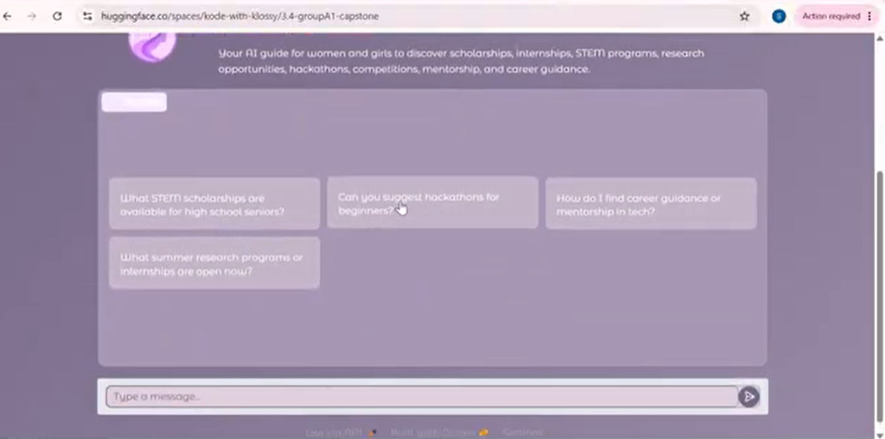
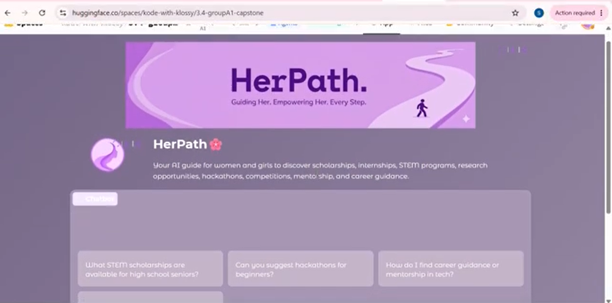

# 🌸 HerPath

### Your AI Guide to Opportunities, Education & Careers for Women in STEM

**HerPath** is an AI-powered career and opportunity discovery assistant designed to help **women and girls navigate STEM education, scholarships, internships, research opportunities, hackathons, competitions, mentorship, and career development**.

Instead of searching through countless websites and opportunity lists, users can simply describe what they are looking for and HerPath uses a **Retrieval-Augmented Generation (RAG)** approach to find relevant information from its knowledge base and generate personalized guidance.

---
## Interface



## 🎥 Demo
Click below to watch the demo video.
[](https://youtu.be/2kJIlEfA6sY)

## Features

-  **Scholarship Discovery**  
  Find relevant scholarships and educational opportunities.

-  **STEM Opportunities**  
  Discover internships, hackathons, competitions, research programs, and other STEM opportunities.

-  **Career Guidance**  
  Get personalized suggestions based on your interests, goals, education level, and location.

-  **Mentorship & Programs**  
  Find programs and opportunities designed to support women in STEM.

-  **Semantic Search**  
  HerPath converts user questions and knowledge-base content into vector embeddings to identify the most relevant information.

-  **AI-Powered Responses**  
  Uses `Qwen/Qwen2.5-Coder-32B-Instruct` through the Hugging Face Inference API to generate responses.

-  **Google Calendar Deadline Reminders**  
  When an application deadline is detected, HerPath automatically generates a Google Calendar link so users can save the deadline.

-  **Interactive Chat Interface**  
  Built with Gradio for a simple and accessible conversational experience.

-  **Personalized & Encouraging Guidance**  
  Responses are designed to be concise, supportive, actionable, and empowering.

---

##  How It Works

HerPath follows a simple **Retrieval-Augmented Generation (RAG)** pipeline:

```text
                    ┌───────────────────┐
                    │    User Query     │
                    └─────────┬─────────┘
                              │
                              ▼
                    ┌───────────────────┐
                    │ Query Embedding   │
                    │ SentenceTransformer│
                    └─────────┬─────────┘
                              │
                              ▼
                    ┌───────────────────┐
                    │ Semantic Search   │
                    │ Cosine Similarity │
                    └─────────┬─────────┘
                              │
                              ▼
                    ┌───────────────────┐
                    │ Top 3 Relevant    │
                    │ Knowledge Chunks  │
                    └─────────┬─────────┘
                              │
                              ▼
                    ┌───────────────────┐
                    │ Context + Query   │
                    └─────────┬─────────┘
                              │
                              ▼
                    ┌───────────────────┐
                    │ Qwen 2.5 Coder    │
                    │ 32B Instruct      │
                    └─────────┬─────────┘
                              │
                              ▼
                    ┌───────────────────┐
                    │ Personalized      │
                    │ Response          │
                    └─────────┬─────────┘
                              │
                              ▼
                    ┌───────────────────┐
                    │ Deadline Detection│
                    │ + Calendar Link   │
                    └───────────────────┘
```

### 1. Knowledge Base

HerPath loads opportunity and guidance information from `knowledge.txt`.

The text is cleaned and divided into individual chunks before being converted into vector embeddings.

### 2. Semantic Retrieval

HerPath uses:

```python
SentenceTransformer("all-MiniLM-L6-v2")
```

to create embeddings for the knowledge base and user queries.

It then calculates **cosine similarity** between the query embedding and knowledge-base embeddings and retrieves the **three most relevant chunks**.

### 3. AI Response Generation

The retrieved information is provided as context to:

```text
Qwen/Qwen2.5-Coder-32B-Instruct
```

through the Hugging Face `InferenceClient`.

The model is instructed to provide relevant opportunities, explain eligibility and benefits, include official links when available, and provide actionable next steps.

### 4. Deadline Detection

HerPath checks AI-generated responses for dates formatted as application deadlines.

For detected deadlines, it generates a **Google Calendar event link** automatically.

---

## 🛠️ Tech Stack

| Technology | Purpose |
|---|---|
|  Python | Core programming language |
|  Gradio | Interactive web interface |
|  Hugging Face | AI inference |
|  Qwen 2.5 Coder 32B | Response generation |
|  Sentence Transformers | Semantic embeddings |
|  PyTorch | Vector similarity calculations |
|  Google Calendar | Application deadline reminders |
|  Custom CSS | User interface styling |

---

##  Project Structure

```text
HerPath/
│
├── app.py                  # Main application
├── knowledge.txt           # Opportunity & guidance knowledge base
├── requirements.txt        # Python dependencies
│
├── logo.png                # HerPath logo
├── updatedbanner.jpeg      # Interface banner
│
└── README.md               # Project documentation
```

> The exact filenames may vary depending on how the project is organized in your repository.

---

##  Getting Started

### Prerequisites

Make sure you have:

- Python 3.9+
- A Hugging Face account/API access
- Git

### 1. Clone the repository

```bash
git clone https://github.com/YOUR-USERNAME/HerPath.git
cd HerPath
```

### 2. Install dependencies

```bash
pip install gradio huggingface_hub sentence-transformers torch
```

Or, if a `requirements.txt` file is included:

```bash
pip install -r requirements.txt
```

### 3. Configure Hugging Face

HerPath uses the Hugging Face Inference API to access the Qwen model.

Create your Hugging Face access token and configure it according to your environment.

For example:

```bash
export HF_TOKEN="your_token_here"
```

**Never commit your API token directly to GitHub.**

### 4. Make sure the knowledge base is available

HerPath expects:

```text
knowledge.txt
```

in the project directory.

The application loads this file when it starts.

### 5. Run HerPath

```bash
python app.py
```

The Gradio interface will launch locally.

---

## 💬 Example Questions

Try asking HerPath:

> **"What STEM scholarships are available for high school seniors?"**

> **"Can you suggest hackathons for beginners?"**

> **"How do I find career guidance or mentorship in tech?"**

> **"What summer research programs or internships are open now?"**

These example prompts are included directly in the application's chat interface.

---

##  Why HerPath?

Finding the right opportunity can be difficult.

Students may need to search across dozens of websites for:

- scholarships
- internships
- competitions
- research programs
- hackathons
- mentorship opportunities
- career programs

HerPath aims to make this process more accessible by bringing opportunity discovery into a **single conversational interface**.

The goal is not simply to provide information, but to help users understand:

**"What opportunity is right for me, and what should I do next?"**

---

##  Technical Highlights

### Semantic Retrieval

Instead of relying only on keyword matching, HerPath represents text as numerical vectors.

```python
chunk_embeddings = model.encode(
    text_chunks,
    convert_to_tensor=True
)
```

The user's query is embedded using the same model and compared against the knowledge base using cosine similarity.

### Top-K Retrieval

HerPath retrieves the three highest-scoring knowledge chunks:

```python
top_indices = torch.topk(similarities, k=3).indices
```

This selected context is then passed to the language model.

### Context-Aware Generation

The retrieved information is inserted into the system prompt so the AI can ground its recommendations in the project's knowledge base.

---

##  Interface

HerPath uses a custom Gradio interface with:

- Purple/violet visual theme
- Custom CSS
- HerPath branding
- Interactive chatbot
- Suggested questions
- Responsive conversational interface

The interface is built using `gr.Blocks`, `gr.ChatInterface`, and a customized Gradio theme. 

---

##  Future Improvements

Potential future development includes:

-  Expanding the opportunity database
-  Automatic opportunity/deadline updates
-  More verified official opportunity sources
-  User profiles and saved preferences
-  Save/bookmark opportunities
-  Opportunity recommendation scoring
-  Automated deadline notifications
-  Multi-language support
-  Mobile-friendly deployment
-  Improved retrieval and ranking
-  Location-specific opportunity recommendations

---

##  Built For

HerPath was created with a particular focus on helping **women and girls explore STEM, education, and career opportunities**.

The AI's system instructions explicitly position it as an empathetic and empowering guide for women in STEM, education, career growth, scholarships, and mentorship.

---

##  License

Add your preferred open-source license here, for example:

```text
MIT License
```

---

##  HerPath

**Discover your opportunities.  
Build your skills.  
Shape your future.**

🌸 *Your path. Your potential. Your HerPath.*
